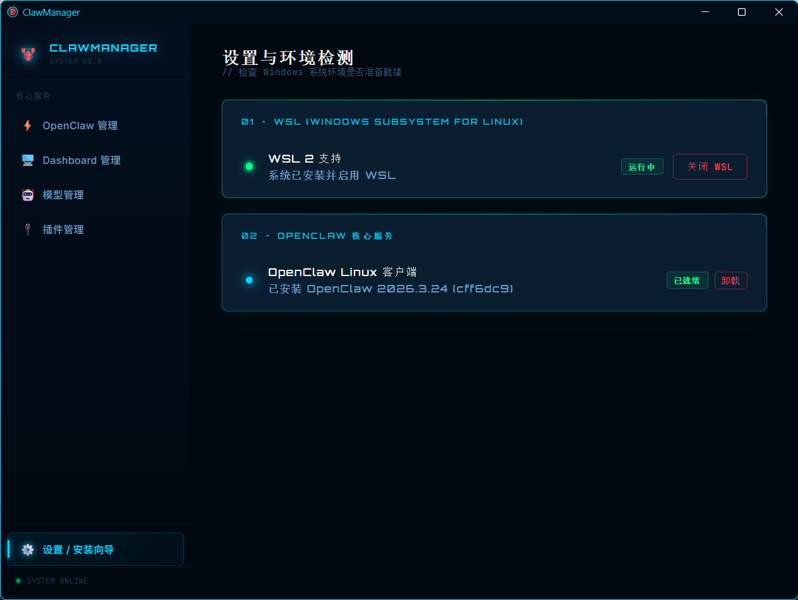

<div align="center">

# 🦀 ClawManager

**OpenClaw 一站式管理工具 · Windows 版**

[](https://github.com)
[](https://github.com)
[](LICENSE)
[](https://learn.microsoft.com/en-us/windows/wsl/)

ClawManager 是一款运行在 Windows 上的 OpenClaw 图形化管理工具，帮助你一键完成 WSL、Ubuntu、OpenClaw 的安装与管理，告别繁琐的命令行操作。



</div>

---

## ✨ 功能特性

- **🔧 一键环境安装** — 自动检测并安装 WSL 2、Ubuntu 发行版及 OpenClaw 客户端
- **⚡ OpenClaw 管理** — 启动、停止、重启 OpenClaw 服务，实时查看运行状态
- **📊 Dashboard 管理** — 可视化监控 OpenClaw 工作面板
- **🧠 模型管理** — 浏览、设置大语言模型Api
- **🔌 插件管理** — 安装与管理 OpenClaw 插件扩展
- **🛡️ 环境检测** — 自动检查 Windows 环境是否满足运行条件

---

## 🖥️ 系统要求

| 项目 | 要求 |
|------|------|
| 操作系统 | Windows 10 (21H2+) / Windows 11 |
| 架构 | x86_64 |
| WSL | WSL 2（可由本工具自动安装）|
| 内存 | 建议 8 GB 以上 |
| 磁盘 | 建议预留 10 GB 以上空间 |

> ⚠️ 需要开启 **虚拟化（Virtualization）** 支持，可在 BIOS/UEFI 中确认。

---

## 🚀 快速开始

### 下载安装

前往 [Releases](https://github.com/your-username/ClawManager/releases) 页面下载最新版本的安装包：

```
ClawManager.exe
```

双击安装包，按照向导完成安装。

### 首次使用

1. 启动 **ClawManager**
2. 进入左侧菜单 **设置 / 安装向导**
3. 工具将自动检测当前环境，并引导你完成以下步骤：
   - ✅ 安装 / 启用 WSL 2
   - ✅ 安装 Ubuntu 发行版
   - ✅ 安装 OpenClaw Linux 客户端
4. 环境就绪后，即可使用全部功能 🎉

---

## 📸 界面预览

| 模块 | 说明 |
|------|------|
| 设置 / 安装向导 | 检测 WSL 状态、OpenClaw 安装状态，一键完成配置 |
| OpenClaw 管理 | 控制服务运行状态 |
| Dashboard 管理 | 可视化工作面板 |
| 模型管理 | 本地模型的下载与切换 |
| 插件管理 | 插件的安装与启用管理 |

---

## 🛣️ 路线图

- [x] Windows 版本基础功能
- [x] WSL 2 自动安装与检测
- [x] OpenClaw 安装向导
- [ ] OpenClaw 版本更新与回滚
- [ ] macOS 版本（计划中）
- [ ] Linux 原生版本（计划中）

---

## 🤝 参与贡献

欢迎提交 Issue 和 Pull Request！

```bash
# Fork 本仓库后克隆到本地
git clone https://github.com/GrowingHacker/ClawManager.git

# 创建你的功能分支
git checkout -b feature/your-feature

# 提交更改
git commit -m "feat: add your feature"

# 推送并创建 Pull Request
git push origin feature/your-feature
```

---

## 📄 开源协议

本项目基于 [MIT License](LICENSE) 开源发布。

---

<div align="center">

Made with ❤️ for the OpenClaw community

</div>